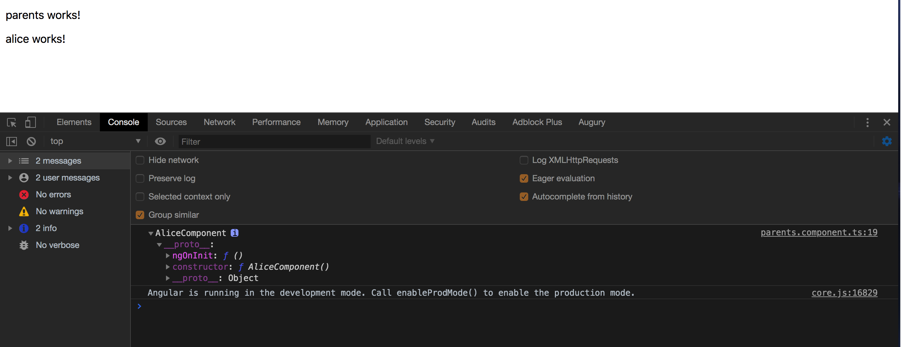

# 高级Web技术 Lab 2 : Angular 框架


# 前言

这篇 Lab 主要包括了 Angular 框架的背景、技术栈和起步指导。具体学习 Angular 推荐同学们去查看[官方文档](https://angular.cn/docs)。


### 1. 安装Node与npm

首先，我们需要安装 Node.js 和 npm。

前往官网下载安装 Node.js , npm 会随着 Node.js 一同安装。

#### Node.js

Node.js 是一个基于 Chrome V8 引擎的 JavaScript 运行时，可以近似理解为脱离浏览器运行 JavaScript 代码的平台。常见用途是开发后端服务器，但是思维导图的 PJ 中是使用Spring boot 开发后端，而不是Node.js。

#### npm

npm = Node Package Manager，绝大部分的现代前端项目中都使用 npm 作为包管理工具。

>原生 npm 在中国的访问速度特别慢，如果没有稳定的翻墙环境，推荐使用阿里的国内 npm 镜像：https://npm.taobao.org/

要想检查你是否已经安装了 npm 客户端，请在终端/控制台窗口中运行 `npm -v` 命令。

### 2. 安装Angular

以下的内容来自angular.cn中文官网:《快速上手》，https://angular.cn/guide/quickstart

好的工具能让开发更加简单快捷。

本章的目标是构建并运行一个超级简单的 TypeScript Angular 应用。使用 Angular CLI 来让每个 Angular 应用从风格指南的那些建议中获益。

在本章的末尾，你会对用 CLI 进行开发有一个最基本的理解，并将其作为其它文档范例以及真实应用的基础。

#### 步骤 1. 设置开发环境

在开始工作之前，你必须设置好开发环境。

如果你的电脑里没有 Node.js®和 npm，请安装它们。

然后全局安装 Angular CLI 。

```
npm install -g @angular/cli
```

>请先在终端/控制台窗口中运行命令 node -v 和 npm -v， 来验证一下你正在运行 node 、npm 和 Angular CLI 的版本。 最新稳定的版本则没问题。


#### 步骤 2. 创建工作区和初始应用

Angular工作区就是你开发应用的上下文环境。每个工作区包含一些供一个或多个项目使用的文件。每个项目都是一组由应用、库或端到端（e2e）测试构成的文件。

要想创建工作区和初始应用项目：

1、运行下列命令来生成一个新项目以及应用的骨架代码：

```
ng new angular-learning
```

2、ng new会提示你要把哪些特性包含在初始的应用项目中。请按回车接受默认值。

Angular CLI会安装必要的Angular npm包及其它依赖。这可能要花几分钟。(卡在安装步骤的同学可以在安装cnpm后先使用`ng new angular-learning --skip-install`创建目录，然后进入angular-learning中，执行`cnpm install`安装依赖包)

还将创建下列工作区和初始项目文件：

* 一个新的工作区，根目录名叫angular-learning
* 一个初始的骨架应用项目，也叫angular-learning（但位于src子目录下）
* 一个端到端测试项目（位于e2e子目录下）
* 相关的配置文件

初始的应用项目是一个简单的“欢迎”应用，随时可以运行它。

#### 步骤 3. 启动开发服务器

Angular包含一个开发服务器，以便能轻易地在本地构建应用和启动开发服务器。

1、进入项目目录

2、使用CLI命令ng server启动开发服务器，并带上`--open`选项

```shell
cd angular-learning
ng serve --open
```

ng serve 命令会启动开发服务器，监听文件变化，并在修改这些文件时重新构建此应用。

使用 --open（或 -o）参数可以自动打开浏览器并访问 http://localhost:4200/。

会看到：


####  步骤4: 使用 npm 添加 Material UI 库

> Material UI 是 Google 推出的一套 UI 设计方案，提供了许多 UI 组件，类似于像 BootStrap 之类的 CSS 库。
>
> 使用 UI 库可以简单方便地编写界面美观的前端项目，大大优于手写 CSS。
>
> 这部分的目的是告诉同学们如何通过npm添加自定义的库，可以跳过。
>
> 参考网址：https://material.angular.io/

```shell
npm install --save @angular/cdk
npm install --save @angular/material
```

安装之后，我们可以注意到 package.json 的dependencies中多了两行：

```
......
    "@angular/cdk": "^9.0.0",
......
    "@angular/material": "^9.0.0",
......
```

新添加的库已经被记录到`package.json`中。

### 3. Angular 起步

#### 3.1 TypeScript

Angular 项目一般使用 TypeScript 来代替 JavaScript。直接写 JavaScript 是合法的，但是不推荐。

TypeScript 是一种编译到 JavaScript 的编程语言，弥补了一些 JavaScript 语言上的一些缺点，比 JavaScript 更加强大好用。

> TypeScript 学习：https://www.typescriptlang.org/index.html

#### 3.2 Angular 基本概念

推荐同学们先把这两个文档看一下，建立一个大概的认识。

Angular项目代码结构： [工作区与项目文件的结构](https://angular.cn/guide/file-structure)

Angular的基本概念：[基本概念简介](https://angular.cn/guide/architecture)

#### 3.3 理解起始工程

下面让我们来理解一下工程的起始页面是如何工作的。

`src/app/app.module.ts` 的主要作用是导入需要用到的库（如 BrowserModule），并声明项目中包含的组件（如 AppComponent）。

`src/app/app.component.ts` 中定义了名为 `AppModule` 的根模块，它会告诉 Angular 如何组装应用。这里最初只声明一个 `AppComponent`。当你向应用中添加更多组件时，它们也必须在这里声明。

`name` 变量在 `AppComponent` 类中被定义为了 `‘angular-learning’` ，修改 `name` 变量的值就可以修改对应的 HTML 代码，这个特性被称为`数据绑定`。

`selector: 'app-root'` 对应的是 `index.html` 中的`<app-root></app-root>`，表示当前组件的代码会被插入到 `<my-app>` 标签中。

#### 3.4 修改起始代码，改成计时器

首先，我们导入刚刚安装的 `Material UI` 组件到 `src/app/app.module.ts` 中：

```typescript
import { BrowserModule } from '@angular/platform-browser';
import { NgModule } from '@angular/core';

import { AppComponent } from './app.component';
import { BrowserAnimationsModule } from '@angular/platform-browser/animations';
import { MatButtonModule } from '@angular/material';


@NgModule({
  declarations: [
    AppComponent,

  ],
  imports: [
    BrowserModule,
    MatButtonModule, 
    BrowserAnimationsModule
  ],
  providers: [],
  bootstrap: [AppComponent]
})
export class AppModule { }
```

这里只导入了 `Material UI` 中的 `MdButtonModule`， 即按钮组件的样式。使用组件则需要导入对应的组件模块。

然后修改 `src/app/app.component.ts` 为：

```typescript
import { Component } from '@angular/core';
import { MatButtonModule } from '@angular/material';

@Component({
  selector: 'app-root',
  template: `
  <h1>Time flows: {{time}}s.</h1>
  <button mat-raised-button (click)="addOneSecond()" color="accent">+1s</button>
  `,
  styleUrls: ['./app.component.css']
})
export class AppComponent {

  time = 0;

  ngOnInit():void {
    let self = this;
    setInterval(function () {
      self.time += 1;
    }, 1000);
  }

  addOneSecond():void {
    this.time += 1;
  }
}

```

 `src/app/app.component.ts` 中目前包含了整个页面的 HTML，CSS 和 TypeScript 代码。

- styles 数组即为当前页面的 CSS 设置。
  - 这种类似内联的方式也不够好，推荐使用外联：修改这行为`styleUrls: ['./app.component.css']`，并将 CSS 代码写在 `app.component.css` 文件中。
  - 在 Component 内的 CSS 代码是局部的，不是全局的，不同 Component 中的 CSS 不会相互影响。不仅如此，你甚至可以在不同 Component 中定义 id 或 class 相同的元素，它们的 CSS 也不会相互影响。
- template 中是页面的 HTML 代码
  - {{time}} 对应 AppComponent 中的 time 变量
  - `md-raised-button` 是 Material UI 里的一种按钮样式（md = material design）
  - `(click)="addOneSecond()"` 表示按钮点击时调用 AppComponent 中的 addOneSecond 方法
  - 与 CSS 相同，将此行改为 `templateUrl: 'app.component.html'` 即可使用外联的方式写 HTML 代码
- AppComponent 中定义了一个 time 变量。
  - ngOnInit 方法会在 AppComponent 首次被加载时调用，里面代码的作用是每秒给 time 变量加一
  - addOneSecond 方法可以直接为 time 变量加一

在```src/styles.css```代码中引入全局的样式文件：

```css
@import '@angular/material/prebuilt-themes/pink-bluegrey.css';
```

运行后界面如图：


demo的代码在这里:

```
https://github.com/2019-web/Angular-Material
```

同学们可以在此基础上自己尝试做些修改。 


## 4. 深入理解组件

### 4.1 背景知识

从父子组件之间的关系谈起，希望能深入理解组件部分。

#### 4.1.1 Angular的“ng-”元素

Angular拥有很多遵循```ng-```命名约定的属性，它们都共享一个共同的特征（它们不会被渲染到最终的DOM中），但是在行为和用法上有所不同。

1. ```<ng-container>```

我们一般用的最多的那个是ng-container。Angular 的``<ng-container>``是一个分组元素，但它不会污染样式或元素布局，因为 Angular压根不会把它放进 DOM中，这部分比较简单的，一般作为容器使用。

2. ```<ng-content>```

将HTML注入到指定位置的模板中的能力，这现在被称为 “内容投影”。在这种情况下，```<ng-content>``` 元素完全被投影内容所取代。

3. ```<ng-template>```

```<ng-template>```是一个 Angular 元素，用来渲染 HTML。 它永远不会直接显示出来。 事实上，在渲染视图之前，Angular 会把 ```<ng-template>``` 及其内容替换为一个注释。

如果没有使用结构型指令（例如```*ngIf```和```*ngFor```），而仅仅把一些别的元素包装进 ```<ng-template>``` 中，那些元素就是不可见的。

```<ng-content>``` 主要是内容投射功能的基础，非常有用；```<ng-template>``` 可以动态创建模板；```<ng-container>``` 主要在条件判断时不引入额外的 DOM 元素。

### 4.2 实验步骤

#### 4.2.1 父子组件关系（Part1）

在终端命令行输入如下的命令 :

```ini
# 创建新的项目，项目名称 lab2-angular-code-part1
ng new lab2-Angulae-code-part1
# 遇到界面提示‘Y/N’，直接按回车即可
# 进入文件夹
cd lab2-Angulae-code-part1
# 创建parents组件
ng generate component parents
# 创建Alice组件
ng generate component alice
# 创建Bob组件
ng generate component bob
# 创建Tom组件
ng generate component tom
```
> 假设parents(父母)有孩子的名称为Alice、Bob和Tom

在```lab2-angular-code-part1/src/app/app.component.html```中，首先清空这个模版页面的内容，然后输入如下的代码:

```html
<app-parents>
  <app-alice></app-alice>
  <app-bob></app-bob>
  <app-tom></app-tom>
</app-parents>
```

在浏览器中去访问```http://localhost:4200```，你会发现只会输出如下的界面内容:

```html
parents works!
```

```<app-parents></app-parents>```标签内部包裹的

```
  <app-alice></app-alice>
  <app-bob></app-bob>
  <app-tom></app-tom>
```
却没有任何输出！

这里在 Vue.js 中也有相似的概念，具体参考 Vue.js 官方文档[编译作用域](https://cn.vuejs.org/v2/guide/components-slots.html#%E7%BC%96%E8%AF%91%E4%BD%9C%E7%94%A8%E5%9F%9F)

作为一条规则，请记住：

> 父级组件里的所有内容都是在父级作用域中编译的；子组件里的所有内容都是在子作用域中编译的。


##### (1) ```<ng-content>```

如果想要输出 alice 和 bob 组件内部的内容，就要在```src/app/parents/parents.component.html```,加入```<ng-content>```闭合标签，模版的代码如下所示:

```html
<p>
  parents works!
</p>
<ng-content></ng-content>
```

这个时候再访问首页，你会发现浏览器上输出了三个组件的模板内容:

```html
parents works!

alice works!

bob works!

tom works!
```

如果你想控制选择性的让 alice、bob 或者 tom 组件输出，可以用```<ng-content>``` 的 ```select```属性，可以选择控制其中内容输出。

在```src/app/parents/parents.component.html```中，代码修改如下 :

```html
parents work！
<!-- app-alice是alice组件的选择器 -->
<ng-content select="app-alice"></ng-content>
```

在浏览器上的输出结果如下:

```html
parents works!

alice works!
```

可以只有看到alice组件的内容输出了，其它两个组件 tom 和 bob 没有内容输出。

在Vue.js中，也有与```<ng-content>```相类似的概念，是```<slot>```，具体参考 Vue.js 官方网站的内容[插槽](https://cn.vuejs.org/v2/guide/components-slots.html#%E6%8F%92%E6%A7%BD%E5%86%85%E5%AE%B9)


##### (2) ContentChild 装饰器

在```lab2-angular-code-part1/src/app/app.component.html```中：

```html
<app-parents>
  <app-alice></app-alice>
  <app-bob></app-bob>
  <app-tom></app-tom>
</app-parents>
```

这个组件调用结果，parents组件可以通过```ContentChild```装饰器去访问得到alice组件内部的内容。
在```lab2-angular-code-part1/src/app/parents/parents.component.ts```中
修改代码为如下:

```javascript
import { Component, OnInit, ContentChild } from '@angular/core';
// 引入AliceComponent组件
import {AliceComponent} from '../alice/alice.component';

@Component({
  selector: 'app-parents',
  templateUrl: './parents.component.html',
  styleUrls: ['./parents.component.css']
})
export class ParentsComponent implements OnInit {
  // 
  @ContentChild(AliceComponent) alice:AliceComponent;
  
  constructor() { }

  ngOnInit() {
  }

  ngAfterContentInit() {
    console.log(this.alice);
  } 

}

```

在 Chrome 浏览器，进入“开发者工具”，可以看到如下的变量输出:



可以看到是打印 AliceComponent 组件内的全部的变量和方法的，我们实际上没有定义，所以看到的内容比较少。

> 实际上，到了这里这种组件的嵌套关系并不是父子组件的关系。

下面开始介绍父子组件的形式：

##### (3) 父子组件

在```lab2-angular-code-part1/src/app/app.component.html```中，代码修改如下:

```html
<app-parents></app-parents>
```
在```lab2-angular-code-part1/src/app/parents/parents.component.html```中，代码修改如下:

```html
<p>
parents work！
</p>
<app-alice></app-alice>
```
在parents组件的模板中引入的标签```<app-alice></app-alice>```，这样parents和alice才构成父子组件的关系。

在浏览器中去访问```http://localhost:4200```，你会发现输出如下的界面内容:

```html
parents works!

alice works!
```

##### (4) ViewChild 装饰器

如果父亲组件想访问子组件内部的属性和方法，用的是 ViewChild 装饰器。

现在我们利用 ViewChild 装饰器让parents组件可以访问得到alice组件内部的方法和属性。

在```lab2-angular-code-part1/src/app/parents/parents.component.ts```中，代码修改如下:

```javascript
import { Component, OnInit, ViewChild} from '@angular/core';
import {AliceComponent} from '../alice/alice.component';

@Component({
  selector: 'app-parents',
  templateUrl: './parents.component.html',
  styleUrls: ['./parents.component.css']
})
export class ParentsComponent implements OnInit {

  @ViewChild(AliceComponent) alice:AliceComponent;
  
  constructor() { }

  ngOnInit() {
  }

  ngAfterContentInit() {
    console.log(this.alice);
  } 

}

```

在 Chrome 浏览器，进入“开发者工具”，可以看到如下的变量输出:


与上面的第一张图的输出结果是一样的。


##### (5) ```<ng-template>```

在```lab2-angular-code-part1/src/app/parents/parents.component.ts```中，代码修改如下 :

```html
<p>
parents work！
</p>
<app-alice></app-alice>
<app-bob></app-bob>
<app-tom></app-tom>
```

在浏览器上的输出结果是:

```html
parents work！

alice works!

bob works!

tom works!
```

实际上，我们发现，alice，bob，tom三个组件的有相同的部分，都是只输出了"组件名 works!"而已。而且alice，bob，tom三个组件几乎完全相同，能否有没有模版来实现这样的操作，下面介绍```<ng-template>```。

在```lab2-angular-code-part1/src/app/parents/parents.component.html```中，代码修改如下 :

```html
<p>
  parents work！
</p>
<!-- 模版的定义 -->
<ng-template #childTemplate let-name="name">
  <p>{{name}} works</p>
</ng-template>

<!-- 对模版赋值 -->
<div [ngTemplateOutlet]="childTemplate" 
        [ngTemplateOutletContext]="{name: 'alice'}">
</div>

<!-- 对模版赋值 -->
<div [ngTemplateOutlet]="childTemplate" 
        [ngTemplateOutletContext]="{name: 'bob'}">
</div>

<!-- 对模版赋值 -->
<div [ngTemplateOutlet]="childTemplate" 
        [ngTemplateOutletContext]="{name: 'tom'}">
</div>
```

可以看到浏览器上输出的结果是 ：

```html
parents work！

alice works

bob works

tom works
```

说明 : 在```<div></div>```标签内部定义的方括号扩起来的，如ngTemplateOutlet、ngTemplateOutletContext一般称之为“指令”。

```#childTemplate```称之为模板引用变量（#var），具体参考官方的文档：[模板引用变量 ( #var )](https://angular.cn/guide/template-syntax#ref-vars)

好的，到这里，我们定义了三个组件，完成的工作都是输出结果，有高度的一致性，我们能不能只定义一个组件 Children 组件，然后利用这个组件去实现三个组件的创建，类似于工厂方法的设计模式呢？

#### 4.2.2 动态组件(Dynamic Component)（Part2）

动态组件的代码可能在最终的 PJ 上是用不到的，这里供拓展相关的知识。

##### (1) 动态创建组件

首先，到了这里，要将之前的三个孩子组件全部删除，可以还要考虑删除引用的问题。

我在这里是重新新建项目，重新创建两个组件，这样简单点，如下操作:

```ini
# 创建新的项目，项目名称 lab2-angular-code-part2
ng new lab2-Angulae-code-part2
# 遇到界面提示‘Y/N’，直接按回车即可
# 进入文件夹
cd lab2-Angulae-code-part2
# 创建parents组件
ng generate component parents
# 创建children组件
ng generate component children
```

parents组件是父组件，children组件是子组件，子组件允许父组件传入值。

在```lab2-angular-code-part2/src/app/children/children.component.html```中，代码修改如下 :

```html
<p>
{{name}} works!
<p>
```

在```lab2-angular-code-part2/src/app/children/children.component.ts```中，代码修改如下 :

```javascript
import { Component, OnInit, Input } from '@angular/core';

@Component({
  selector: 'app-children',
  templateUrl: './children.component.html',
  styleUrls: ['./children.component.css']
})
export class ChildrenComponent implements OnInit {

  // 组件name值允许外部输入
  @Input() name:string;

  constructor() { }

  ngOnInit() {
  }

}
```

在```lab2-angular-code-part2/src/app/parents/parents.component.html```中，代码修改如下:

```html
<p>
  parents works!
</p>
<ng-template #addChild></ng-template>
<button (click)="createComponent('alice');">add alice</button>
<button (click)="createComponent('bob');">add bob</button>
<button (click)="createComponent('tom');">add tom</button>

```

```#addChild```是模板引用变量。


在```lab2-angular-code-part2/src/app/parents/parents.component.ts```中，代码修改如下:

```javascript
import { Component, OnInit, ComponentFactory,ViewContainerRef,ViewChild, OnDestroy,ComponentFactoryResolver, TemplateRef } from '@angular/core';
import { ChildrenComponent } from '../children/children.component';
import { ComponentRef } from '@angular/core';

@Component({
  selector: 'app-parents',
  templateUrl: './parents.component.html',
  styleUrls: ['./parents.component.css']
})
export class ParentsComponent implements OnInit, OnDestroy {

  // Children组件的引用
  componentRef: ComponentRef<ChildrenComponent>;

  // 通过 ViewChild 装饰器来获取视图中的模板引用变量#addChild，如果没有指定第二个查询参数read，则默认返回的组件实例或相应的 DOM 元素，但是在这里我们需要获取 ViewContainerRef 实例。
  @ViewChild("addChild", { read: ViewContainerRef }) addChild: ViewContainerRef;

  // 在我们定义 createComponent() 方法前，我们需要注入 ComponentFactoryResolver 服务对象。该 ComponentFactoryResolver 服务对象中，提供了一个很重要的方法 - resolveComponentFactory() ，该方法接收一个组件类作为参数，并返回 ComponentFactory
  constructor(private componentFactoryResolver: ComponentFactoryResolver) { }

  ngOnInit() {

  }

  createComponent(name: string) {
    
    // 每次我们需要创建组件时，我们需要删除之前的视图，否则组件容器中会出现多个视图 (如果允许多个组件的话，就不需要执行清除操作 )。
    this.addChild.clear();
    // resolveComponentFactory() 方法接受一个组件并返回如何创建组件的 ComponentFactory 实例
    let componentFactory : ComponentFactory<ChildrenComponent>= this.componentFactoryResolver.resolveComponentFactory(ChildrenComponent);
    // 帮助理解调试
    console.log(componentFactory); 
    // 创建组件引用
    this.componentRef= this.addChild.createComponent(componentFactory);
    // 已经能获取新组件的引用，即可以我们可以设置组件的输入类型，传入name字符串
    this.componentRef.instance.name=name;
    console.log(this.componentRef);


  }
  ngAfterViewInit() {
    console.log(this.addChild);
  }

  ngOnDestroy() {

  }
}

```

在```lab2-angular-code-part2/src/app/app.module.ts```中，代码修改如下:

```javascript
import { BrowserModule } from '@angular/platform-browser';
import { NgModule } from '@angular/core';

import { AppComponent } from './app.component';
import { ParentsComponent } from './parents/parents.component';
import { ChildrenComponent } from './children/children.component';

@NgModule({
  declarations: [
    AppComponent,
    ParentsComponent,
    ChildrenComponent,
  ],
  imports: [
    BrowserModule
  ],
  providers: [],
  // 将动态组件 ChildrenComponent 添加到 NgModule 的 entryComponents 中
  entryComponents:[ChildrenComponent],
  bootstrap: [AppComponent],
})
export class AppModule { }

```

在浏览器中去访问```http://localhost:4200```，你会发现输出如下的界面内容，点击不同的按钮，可以看到不同的值，同时在点击按钮的过程中，完成Children组件的创建。


##### (2) Modal 组件模版 

这里在前面叙述 ```(1) 动态创建组件```，是想抛砖引玉说明一下，阿里云的Angular UI框架NG-ZORRO或ng-bootstrap中Modal（模态框）组件部分的使用。

具体的文档:

NG-ZORRO [服务方式创建Modal](https://ng.ant.design/components/modal/zh#components-modal-demo-service)


ng-bootstrap [Modal with options](https://ng-bootstrap.github.io/#/components/modal/examples#options)

这里太深入的东西，我就不是很懂了，原理部分应该是前面叙述的```(1) 动态创建组件```部分，点到为止。


## 5. 继续学习 Angular

继续学习 Angular 请阅读官方 Tutorial。

相关参考：

1. [动态组件加载器](https://angular.cn/guide/dynamic-component-loader)

2. [ViewChild](https://angular.cn/api/core/ViewChild)

3. [ContentChild](https://angular.cn/api/core/ContentChild)

4. [ngTemplateOutlet](https://angular.cn/api/common/NgTemplateOutlet)

5. [模板引用变量 ( #var )](https://angular.cn/guide/template-syntax#ref-vars)

6. [Angular 4.x 动态创建组件](https://segmentfault.com/a/1190000009175508)

> Angular 官方网站: https://angular.io，中文网站：https://angular.cn。推荐先阅读文档中的 Tutorial 部分实现官方样例，再阅读 Guide 部分详细了解 Angular 的工作原理。
>
> Angular 开发相关资源：https://angular.io/resources，中文：https://angular.cn/resources。其中，IDE 推荐使用 IntelliJ 或者 WebStorm，Tooling 部分推荐学习 Angular CLI，UI Component 部分列举了目前主要的 UI 库，跨平台开发部分推荐了解 Ionic 和 Electron。
>
> TypeScript: https://www.typescriptlang.org/index.html
>
> npm: https://docs.npmjs.com/getting-started
>
> china npm: https://npm.taobao.org/
>
> Node.js: https://nodejs.org

## 6. 课后作业

截止时间：待定

提交方式：待定

**题目:** 

- 在第一部分，给alice组件定义属性```age=13```，方法```sayHello() {console.log("alice say hello")}```，然后利用装饰器 ContentChild 在 parents 组件中调用 alice 组件内的属性和方法。这部分代码以“姓名+学号+angular+part1.zip”的压缩，(node_modules文件夹不包括)

- 在第二部部分，子组件有一个```input```的属性，输入了姓名```name```字段值。现在要求以合理的方式实现父子组件通信的功能，功能上不要求。这部分代码以“姓名+学号+angular+part2.zip”的压缩，(node_modules文件夹不包括)


